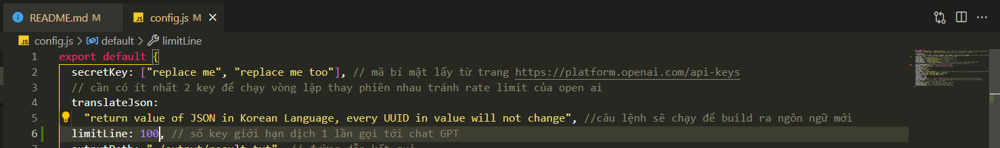
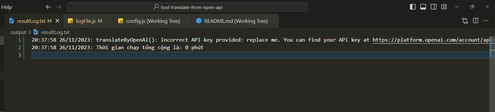
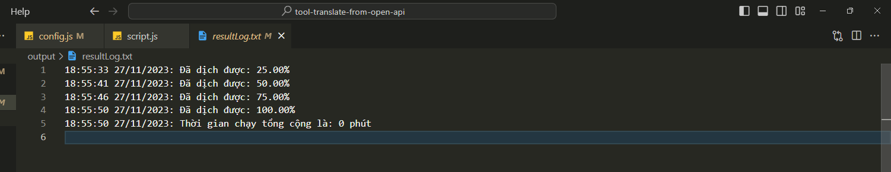
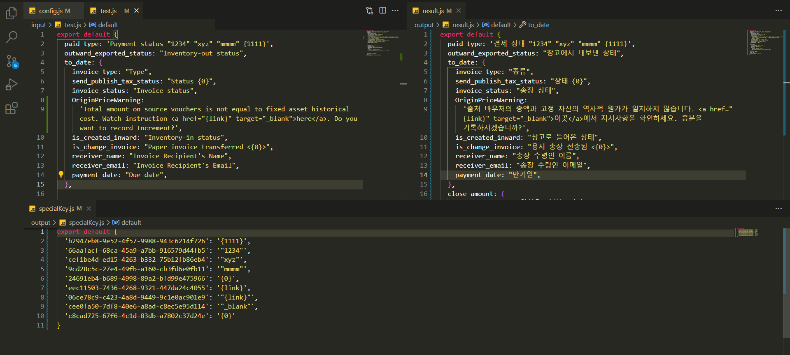
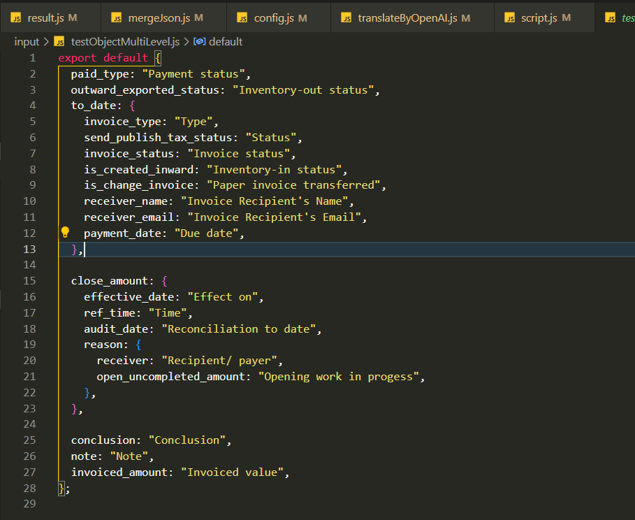
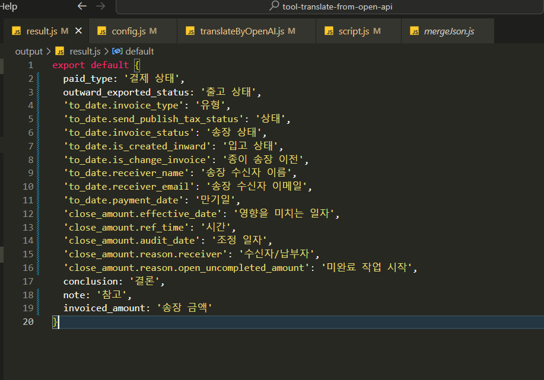
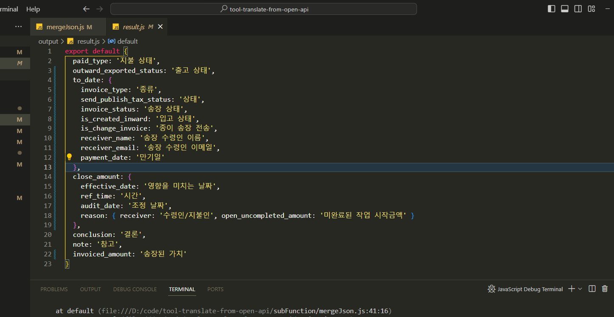
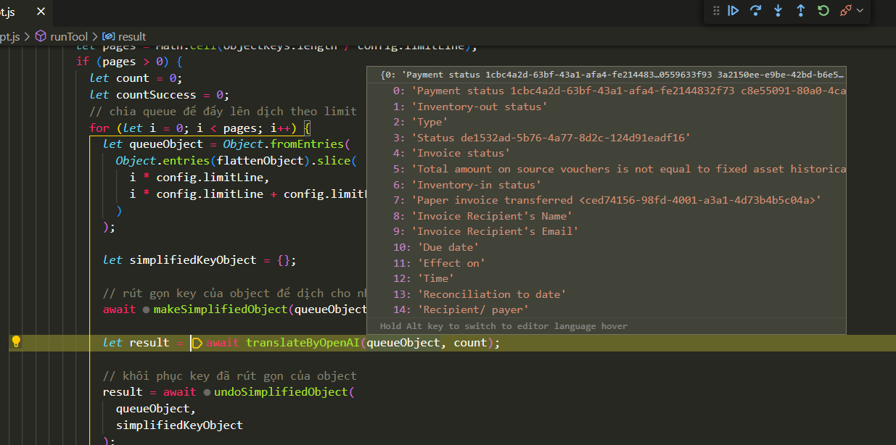
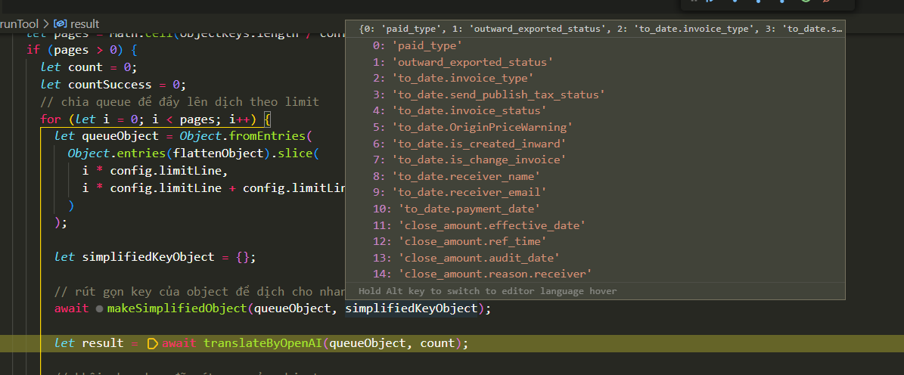
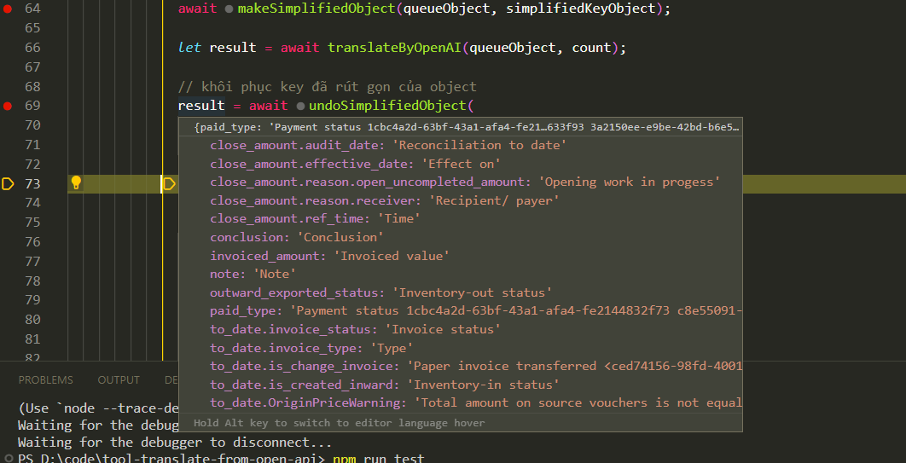

## Tool giúp dịch value của object trong javascript sang ngôn ngữ đích bằng openAI

### Mục lục

[1. Yêu cầu](#requirement)\
[2. Hướng dẫn](#tutorial)\
[3. Tra log](#log)\
[4. Xóa ký tự đặc biệt trong value JSON](#remove-special)\
[5. Object nhiều level thành 1 object 1 level](#simplified-object)\
[6. Rút gọn key của object](#short-link)\
[7. Sửa lỗi và merge lại file](#merge-file)\
[8. Kiểm tra xem đã dịch được hết object chưa](#double-check)

### <a name="requirement"></a> 1. Yêu cầu
> online
> 
> Sử dụng github Codespaces để chạy project này
>
> offline
> 
> Máy tính có 2 tài khoản openai, lưu lại secretkey, cho vào config.js
>
> Cài đặt nodejs >= 16.0.0
>
> Cài đặt vscode để chạy nodejs
>
> Đọc kỹ file config.js để hiểu các cấu hình tùy chỉnh

### <a name="tutorial"></a> 2. Hướng dẫn

```
Tool sử dụng cơ chế chia file dịch
thành nhiều queue nhỏ dựa vào config limitLine trong config.js,1 dòng nhiều chữ
thì để limitLine nhỏ, 1 dòng ít chữ thì để limitLine lớn, 2 tài khoản mỗi khi chạy
xong số dòng ứng với limitLine sẽ switch cho nhau tránh ratelimit của openai
```



```
Thực hiện cài nodeJS sau đó chạy bằng terminal lệnh
# npm install
```

```
Để chạy demo việc dịch file js object nhiều level,
đọc từ file: test.js, chạy termial bằng lệnh
# npm run test
```

```
Copy text muốn dịch vào trong file: originalLangObject.js
chạy terminal lệnh dưới và đợi kết quả ở file: result.js
# npm run serve
```

```
Nếu muốn thực hiện merge từ file kết quả result.txt (không gọi lại chatgpt)
# npm run merge
```

### <a name="log"></a> 3. Tra log

Trường hợp chạy có thể văng exception, tra log tại file resultLog.txt

File này sẽ chứa cả thông tin % file js được dịch


### <a name="remove-special"></a> 4. Xóa ký tự đặc biệt trong value JSON

Mục đích tránh những lỗi không mong muốn khi json parse, json stringify.
Những ký tự đặc biệt được cấu hình trong config.js tại Key "specialKeyNeedReplace" sẽ được loại bỏ trước khi dịch, những ký tự này sẽ được chuyển đổi thành UUID, sau khi dịch sẽ rollback từ UUID về ký tự đặc biệt

ví dụ, bạn muốn loại bỏ những ký tự đặc biệt giữa 2 dấu "" thì dùng regex

```
 /\"(.*?)\"/gi
```

### <a name="simplified-object"></a> 5. Object nhiều level thành 1 object 1 level

Mục đích trải phẳng object thành 1 cấp.
Hình dưới là object khi chưa dịch value, đây là 1 object có nhiều cấp

Hình dưới là object khi dùng tool sẽ được trải phẳng từ nhiều cấp về 1 cấp.
Sau này người dùng có thể xác định được cấp nào với cấp nào, tránh nhầm key các object con.

Hình dưới là object khi đã dịch value, object ở dạng trải phẳng

Hình dưới là kết quả final khi object đã được trả về hình dạng nhiều cấp ban đầu và dịch thành công


### <a name="short-link"></a> 6. Rút gọn key của object

Mục đích để số ký tự gửi đi được giảm thiểu.
Hình dưới là json đã được làm đơn giản hóa key

Hình dưới là store lưu những key được làm đơn giản hóa

Hình dưới là sau khi json đã được khôi phục key ban đầu


### <a name="merge-file"></a> 7. Sửa lỗi và merge lại file

Mục đích tận dụng số file đã dịch và group lại.
Sẽ có những lúc chat GPT trả lời ra những câu thừa, thừa các ký tự đặc biệt
nên khi cố gắng parse từ text object 1 level về file javascript object nhiều level bị lỗi.
Cách xử lý:

- Copy toàn bộ nội dung trong file result.txt vào 1 file javascript trống
- Thêm export default ở đầu file javascript
- Kiểm tra những chỗ báo đỏ trong file javascript và sửa lại cho hết lỗi
- Copy toàn bộ nội dung vừa sửa vào lại file result.txt (trừ từ "export default")
- Thực hiện chạy lệnh "npm run merge" để build lại thành file js hoàn chỉnh

Tra log trong resultLog.txt:

- Trường hợp là lỗi ký tự đặc biệt không json parse được thì thêm ký tự đặc biệt đó vào config phần "specialKeyNeedReplace" để bỏ qua không dịch.
- Trường hợp object trả về trong result.txt không hoàn chỉnh, dịch sót thì vào lại config.js cấu hình lại limitLine giảm xuống (để dịch ít dòng hơn nhưng đủ ký tự hơn).

### <a name="double-check"></a> 8. Kiểm tra xem đã dịch được hết object chưa

Đừng quá tin tưởng vào chatGPT, có thể nó dịch bị double key hoặc bị miss key.
Sử dụng tool ở link bên dưới để double check lại xem đã dịch được bao nhiêu key của file rồi, key mà dịch xong vẫn có value giống key gốc cũng sẽ hiển thị. Sau khi đã chạy và xuất ra được object các key chưa dịch thì cho lại vào tool dịch này trong file originalLangObject.js và chạy "npm run serve" để dịch tiếp; rồi lại cho vào phần addmore của tool dưới ....

> https://github.com/tonguyenducmanh/mapping-json
